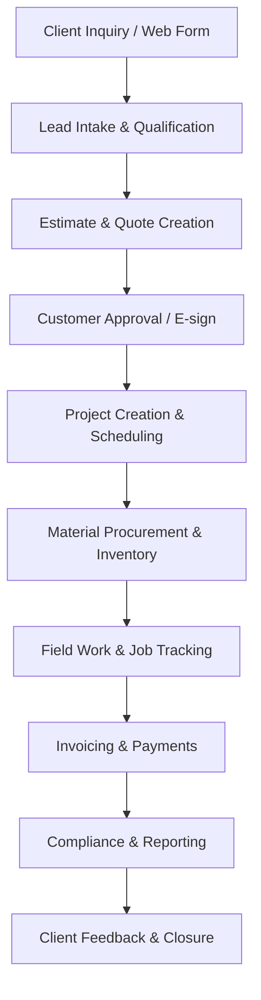
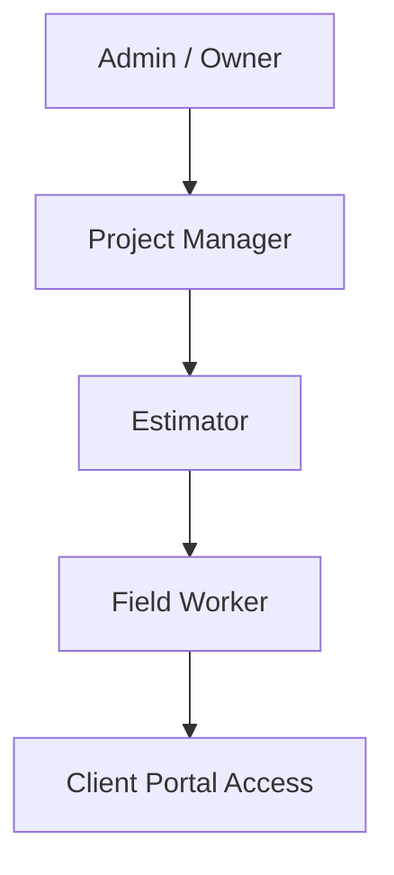
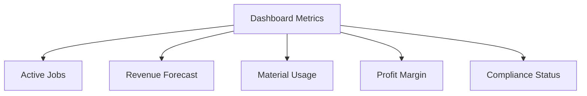

---
**Document Title:** Construction Management SaaS PRD — New Hampshire Edition  
**Version:** 1.0  
**Prepared For:** Internal Use – Founders, Operations, and Design Teams  
**Prepared By:** Product Development Team  
**Date:** October 2025  
---

# 🏗️ Construction Management SaaS PRD — New Hampshire Edition  
*(Part 1: Business / Strategic Product Requirements Document)*  

## Introduction  

This document outlines the **strategic business plan and functional scope** for a SaaS platform designed to manage small-to-medium construction companies in **New Hampshire**.  
The platform provides **end-to-end lifecycle management** — from customer inquiry and quoting to job execution, compliance, invoicing, and reporting — through a **modern web-based dashboard**.  

All customer and internal functions will be delivered as a **SaaS web application**, with a customer-facing site and a professional contractor dashboard. The system will later expand to include AI-driven estimation, subcontractor marketplace, and sustainability metrics.  

---

## 1. Product Overview  

### Purpose  
Provide a **cloud-based construction management platform** tailored for New Hampshire contractors. The system reduces manual paperwork, improves transparency, ensures compliance, and accelerates billing cycles.

### Vision Statement  
To become the **central digital hub** for small construction firms, combining operational management, customer communication, and compliance under one secure, scalable SaaS solution.

### Value Proposition  
- **For Contractors:** Simplifies operations, increases profitability, ensures legal compliance.  
- **For Clients:** Offers visibility, faster service, and transparent billing.  
- **For Suppliers:** Creates integration opportunities for materials and delivery tracking.  

---

## 2. Target Users  

| User Type | Description | Key Goals |
|-----------|-------------|-----------|
| **Owner / Administrator** | Small business owner or operations lead | Manage all jobs, staff, clients, billing |
| **Project Manager** | Oversees multiple ongoing projects | Track progress, schedules, budgets |
| **Estimator** | Handles quotes and job pricing | Build accurate cost estimates quickly |
| **Field Worker / Foreman** | Works on-site | Update progress, upload photos, complete tasks |
| **Client / Customer** | Requests quotes and tracks projects | Get quotes, approve work, make payments |

---

## 3. Core Platform Objectives  

1. **Unified SaaS Dashboard:**  
   Centralize project management, estimates, billing, and reporting.  

2. **Streamlined Customer Interaction:**  
   Clients can request quotes, upload files/photos, and track project status online.  

3. **Automation & Efficiency:**  
   Automated cost calculations, reminders, and compliance workflows.  

4. **NH-Specific Compliance:**  
   Built-in templates for lien waivers, license tracking, and OSHA reports per NH DOL §1400.  

5. **Scalability:**  
   Multi-tenant SaaS architecture for contractors of different sizes.  

---

## 4. High-Level Workflow  

---

## 5. Core Modules and Business Features

| Module | Key Capabilities | Business Value |
|--------|------------------|----------------|
| Leads & CRM | Capture and manage inquiries, follow-ups | Faster conversion and reduced drop-offs |
| Estimating | Automated cost breakdowns by trade/labor/material | Consistent, data-driven quoting |
| Quote Management | Create, send, and track quote approvals | Reduces delays in project onboarding |
| Scheduling | Gantt chart, team assignment, and weather integration | Ensures on-time delivery |
| Job Management | Track project status, milestones, and field activity | Central project visibility |
| Materials & Inventory | Manage supplier catalogs, purchase orders | Prevents material shortages and waste |
| Invoicing & Payments | Stripe/QuickBooks integration for billing | Improves cash flow and transparency |
| Compliance & Safety | Generate NH-compliant forms and reports | Reduces risk and penalties |
| Dashboard & KPIs | Real-time overview of operations | Enables better management decisions |
| Client Portal | Clients access quotes, invoices, photos | Enhances customer trust and satisfaction |

---

## 6. Customer-Facing Website Features

| Feature | Description |
|---------|-------------|
| Quote Request Form | Collect job details, photos, documents |
| File Uploads | Clients attach blueprints, photos, or insurance docs |
| Customer Dashboard | View quotes, invoices, and job status |
| E-signature | Approve quotes and contracts digitally |
| Support Chat / Help Desk | Optional live chat or ticket submission |
| Feedback & Review Form | Collect client satisfaction data post-job |

---

## 7. User Roles & Permissions

| Role | Permissions |
|------|-------------|
| Admin | Full control over company settings, billing, and all modules |
| Project Manager | Manage jobs, schedules, teams, and budgets |
| Estimator | Create and send estimates and quotes |
| Field Worker | Upload job photos, mark tasks complete |
| Client | View quotes, invoices, and project progress |

---

## 8. UX & Design Guidelines

- **Design System:** Modern, intuitive interface with minimal clutter.
- **Color Palette:** Light neutral tones with accent colors for warnings and compliance alerts.
- **Accessibility:** WCAG 2.1 AA compliant.
- **Responsiveness:** Optimized for tablets and smartphones (on-site usability).
- **Onboarding:** Guided tooltips, contextual help, and templates for new users.

---

## 9. Legal & Regulatory Compliance (New Hampshire Focus)

| Category | NH Regulation | SaaS Functionality |
|----------|---------------|-------------------|
| Contracts & Liens | RSA 447 – Mechanic's Liens | Automatic lien release tracking |
| Safety & Labor | NH DOL §1400 | OSHA form generation and incident reporting |
| Electronic Transactions | RSA 294-E | Secure e-signature and consent storage |
| Tax & Accounting | NH DRA Integration | Automated tax lookups and payment logs |
| Data Privacy | NH Data Retention Laws | Encrypted file storage and timed purging |

---

## 10. Analytics & Reporting

**KPIs Monitored:**

- Job completion rate
- Cost variance
- Invoice delay average
- Resource utilization
- Compliance score

---

## 11. Competitive Edge

| Strength | Description |
|----------|-------------|
| NH Compliance-Built | Tailored for New Hampshire contractors |
| Full SaaS Solution | Combines customer, financial, and field management |
| Ease of Use | Intuitive UX for non-technical construction teams |
| Integrations | Stripe, QuickBooks, Google Maps, and Mailchimp |
| Future-Ready | AI estimation and subcontractor marketplace in roadmap |

---

## 12. Development Roadmap (12-Month Plan)

| Phase | Duration | Deliverables |
|-------|----------|--------------|
| Phase 1 – MVP | 3 months | Leads, Quotes, Projects, Dashboard |
| Phase 2 – Integrations | 2 months | Stripe, QuickBooks, Inventory |
| Phase 3 – Dashboard Expansion | 3 months | Advanced Analytics + Mobile |
| Phase 4 – Compliance & Reporting | 2 months | OSHA + Lien Automation |
| Phase 5 – Beta Launch | 2 months | User Testing & Feedback Loop |

---

## 13. Future Enhancements

- **AI Estimation Engine:** Predict project costs using historical data.
- **Subcontractor Marketplace:** Connect certified subcontractors.
- **AR Visualization:** View 3D job overlays on mobile.
- **Sustainability Metrics:** Carbon tracking per material type.

---

## 14. Success Metrics

| Category | KPI |
|----------|-----|
| User Growth | 200+ NH contractors in year 1 |
| Customer Satisfaction | 90% positive client feedback |
| Efficiency | Reduce average quote-to-job time by 40% |
| Revenue | SaaS subscription + transaction-based income |

---

## 15. Summary

This platform delivers a complete digital foundation for New Hampshire construction companies to manage every step of their workflow in one SaaS dashboard.

By uniting job management, compliance, customer interaction, and payments in a single interface, the system will set a new operational standard for small-to-medium contractors.