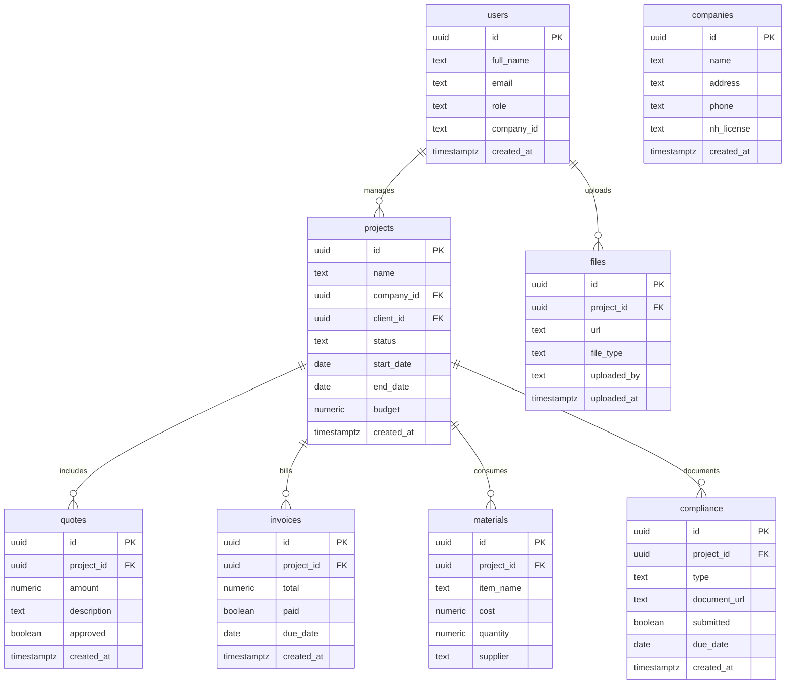

# 🟦 Construction Management SaaS PRD — New Hampshire Edition

*Part 2: Technical / Developer Product Requirements Document*

---

## 1. System Overview

The Construction Management SaaS platform is built using a **split architecture**:

- **Frontend:** Next.js (React-based) for customer and contractor dashboards.
- **Backend:** Node.js (Express or Fastify) REST API for business logic.
- **Database & Auth:** Supabase (PostgreSQL + Auth + Storage).
- **Hosting & Infra:** AWS for backend (Lambda or EC2) and Vercel for frontend.
- **Integrations:** Stripe, QuickBooks, Google Maps API, Mailchimp, Weather API.

The system supports **multi-tenancy**, **secure role-based access**, and **real-time synchronization** between front-end dashboards and the Supabase backend.

---

## 2. High-Level Architecture

```mermaid
graph TD
    A[Customer Web App (Next.js)] -->|API Calls| B[Node.js Backend]
    B -->|Auth / Data| C[Supabase (PostgreSQL + Auth + Storage)]
    B -->|Integrations| D[Stripe / QuickBooks / Mailchimp / Weather]
    C -->|Backup| E[(AWS S3 Encrypted Storage)]
    A -->|Uploads| C
    B -->|Reports| F[Analytics Engine]
    F --> A
```

**Key Points:**

- All user authentication, file uploads, and data storage flow through Supabase.
- Node backend acts as the intermediary for business logic and secure integrations.
- Next.js provides both the customer portal and contractor dashboard from separate front-end routes.

---

## 3. Environment and Tooling

| Layer          | Framework / Service                             |
|----------------|------------------------------------------------|
| Frontend       | Next.js 15+, React 18+, TailwindCSS, Framer Motion |
| Backend        | Node.js 22+, Express/Fastify, TypeScript        |
| Database       | PostgreSQL (Supabase)                          |
| Storage        | Supabase Storage (S3-compatible)                |
| Authentication | Supabase Auth + JWT (OAuth2.0 compatible)      |
| CI/CD          | GitHub Actions + AWS CodePipeline              |
| Testing        | Jest (unit), Cypress (E2E), Postman (API)      |

---

## 4. Authentication and Authorization

Supabase Auth handles sign-ups, logins, password resets, and token refresh.

Role-Based Access Control (RBAC) implemented via Supabase policies and backend validation.

### Roles

| Role            | Permissions                                    |
|-----------------|------------------------------------------------|
| Admin           | Full CRUD across all modules                   |
| Project Manager | CRUD on jobs, tasks, staff, materials           |
| Estimator       | Create/update quotes and pricing               |
| Field Worker    | Read/write job logs and photos                 |
| Client          | Read-only quotes, invoices, project status      |

### Auth Flow


---

## 5. Database Schema (Supabase / PostgreSQL)

### Core Tables



**Notes:**

- Multi-tenancy handled by `company_id` foreign key.
- Supabase Row Level Security (RLS) enforces user-company isolation.
- All files stored in Supabase Storage, with metadata in the `files` table.

---

## 6. API Endpoints (Node.js / Express)

### Auth Routes

| Method | Endpoint            | Description                        |
|--------|---------------------|------------------------------------|
| POST   | `/auth/login`       | Authenticate user via Supabase     |
| POST   | `/auth/register`    | Register new user and assign role  |
| POST   | `/auth/refresh`     | Refresh JWT token                  |

### Project Routes

| Method | Endpoint            | Description                        |
|--------|---------------------|------------------------------------|
| GET    | `/projects`         | List all projects for user/company |
| POST   | `/projects`         | Create new project                 |
| GET    | `/projects/:id`     | Retrieve project details           |
| PATCH  | `/projects/:id`     | Update project details             |
| DELETE | `/projects/:id`     | Archive project                    |

### Quote & Invoice Routes

| Method | Endpoint                   | Description                        |
|--------|----------------------------|------------------------------------|
| POST   | `/quotes`                  | Create new quote                   |
| GET    | `/quotes/:projectId`       | Retrieve all quotes for project    |
| PATCH  | `/quotes/:id/approve`      | Mark quote as approved             |
| POST   | `/invoices`                | Generate invoice                   |
| PATCH  | `/invoices/:id/pay`        | Mark invoice as paid               |

### File & Compliance Routes

| Method | Endpoint                   | Description                        |
|--------|----------------------------|------------------------------------|
| POST   | `/files/upload`            | Upload document or photo           |
| GET    | `/files/:projectId`        | List project files                 |
| POST   | `/compliance`              | Submit compliance form             |
| GET    | `/compliance/:projectId`   | View compliance status             |

---

## 7. Frontend (Next.js)

### Folder Structure

```bash
/app
  /dashboard
    /projects
    /quotes
    /invoices
    /materials
    /compliance
  /client
    /quotes
    /invoices
  /auth
    login.tsx
    register.tsx
/components
  ProjectCard.tsx
  QuoteForm.tsx
  InvoiceTable.tsx
  FileUploader.tsx
/lib
  api.ts
  supabaseClient.ts
```

### UI Components

- **Dashboard Layout:** Responsive sidebar + content pane.
- **Data Fetching:** Server-side (SSR) for admin, client-side (CSR) for clients.
- **Charts:** Recharts for KPIs and project analytics.
- **File Uploads:** Supabase Storage API with progress indicators.
- **Forms:** React Hook Form + Zod validation.

---

## 8. Integrations

| Service          | Function                              |
|------------------|---------------------------------------|
| Stripe           | Payment processing and webhooks       |
| QuickBooks API   | Sync invoices and payments            |
| Google Maps API  | Address autocomplete and job site mapping |
| Mailchimp API    | CRM and follow-up automation          |
| OpenWeather API  | Weather data for scheduling delays    |

---

## 9. Security & Compliance

- **Encryption:** AES-256 for stored data, TLS 1.3 for transport.
- **Audit Logging:** All CRUD actions stored in `audit_logs` table.
- **SOC 2 Type II Alignment:** AWS + Supabase.
- **NH RSA Compliance:** Document retention and electronic signature validation.
- **Backups:** Nightly encrypted backup of Supabase DB to S3.
- **Incident Response:** Auto-notify admin on data breach or system anomaly.

---

## 10. CI/CD and Deployment

**Workflow:**

- GitHub Actions runs unit + integration tests.
- On merge to `main`, AWS CodePipeline deploys Node backend to AWS Lambda.
- Vercel auto-deploys Next.js frontend.
- Supabase migrations run automatically via CLI on deploy.
- Monitoring via AWS CloudWatch and Sentry.

---

## 11. QA & Testing

| Type            | Tool          | Description                        |
|-----------------|---------------|------------------------------------|
| Unit Tests      | Jest          | Backend and utility logic          |
| Integration Tests | Supertest   | API endpoint validation            |
| E2E Tests       | Cypress       | Full user journey tests            |
| Load Tests      | Artillery     | Performance and stress tests       |
| Manual QA       | Checklists    | Regression and UX validation       |

---

## 12. Monitoring & Maintenance

- **Error Tracking:** Sentry
- **Performance Monitoring:** AWS X-Ray
- **Logging:** Winston + CloudWatch
- **Uptime Monitoring:** Pingdom or Healthchecks.io
- **Backup Rotation:** 30-day retention with weekly verification

---

## 13. Future Technical Enhancements

| Feature                    | Technical Summary                                   |
|----------------------------|----------------------------------------------------|
| AI Estimation Engine       | Use historical project data + ML regression for pricing |
| Subcontractor Marketplace  | Multi-tenant API layer for external contractor onboarding |
| AR Visualization           | WebAR module using Three.js and device camera APIs |
| Carbon Footprint Tracker   | Integrate environmental data APIs to track material CO₂ output |

---

## 14. Development Milestones

| Phase   | Key Deliverables                              | Stack Focus              |
|---------|-----------------------------------------------|--------------------------|
| Phase 1 | MVP (Projects, Quotes, Invoicing, Auth)       | Next.js + Node + Supabase |
| Phase 2 | Integrations (Stripe, QuickBooks, Weather)    | Backend API               |
| Phase 3 | Dashboard Analytics + Mobile Layout           | Frontend UX              |
| Phase 4 | Compliance Automation                        | Supabase RLS + Reporting |
| Phase 5 | Beta Feedback + Optimization                  | DevOps / QA              |

---

## 15. Summary

This technical design ensures the Construction Management SaaS platform is secure, scalable, and compliant with New Hampshire construction regulations. By leveraging Next.js, Node.js, and Supabase, it provides a modern, maintainable foundation for a long-term SaaS product capable of supporting contractors, clients, and suppliers under a unified system.